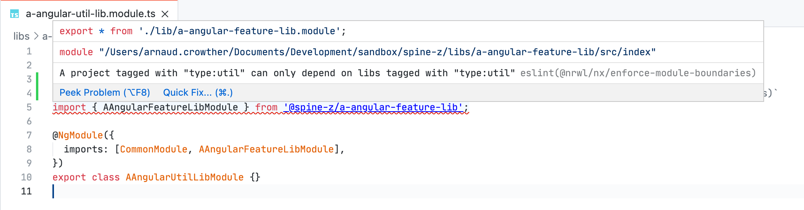

# This is an example NX repo with ESLint enabled

It contains Angular, NestJS, React, and Next.js examples

## Workspace plugins required

`.vscode/extensions.json`

These two plugins NEED to be added to the recommended plugins:

```
"rvest.vs-code-prettier-eslint",
"dbaeumer.vscode-eslint"
```

Without them, there will be no syntax highlighting for ESLINT detected workspace errors.

Links:

- https://marketplace.visualstudio.com/items?itemName=dbaeumer.vscode-eslint
- https://marketplace.visualstudio.com/items?itemName=rvest.vs-code-prettier-eslint

## Example module boundary conflict

`libs/a-angular-util-lib/src/lib/a-angular-util-lib.module.ts`

Open the referenced file above and you should see a red highlight on line 5. This is indicative of a `@nrwl/nx/enforce-module-boundaries` violation.



If that error is not visible in your IDE, you do not have the correct plugins configured.

## Enabling ESLint locally

You must activate the `rvest.vs-code-prettier-eslint` plugin upon install. The steps are listed in the repository: https://github.com/Microsoft/vscode-eslint#release-notes and the description page of the plugin.
